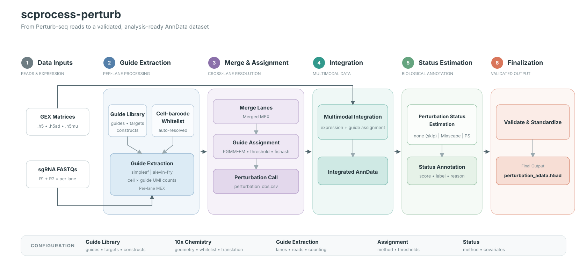

# scprocess-perturb

## A single-cell perturbation screen preprocessing workflow

`scprocess-perturb` processes Perturb-seq guide FASTQs together with a gene
expression matrix and produces a validated, analysis-ready AnnData dataset. The
workflow covers guide extraction, guide assignment, multimodal integration,
perturbation-status estimation, and data validation and standardization.

## Workflow overview



The complete workflow follows six stages:

1. Read guide FASTQs and expression matrices.
2. Quantify guide UMIs independently for each lane.
3. Merge lanes and assign valid guides to cells.
4. Integrate expression, assignment, construct, and source metadata.
5. Run Mixscape or PS when a perturbation-status method is specified; otherwise
   skip the calculation while retaining a common output interface.
6. Validate the data contract and write the standardized AnnData output.

The workflow can also stop at an earlier target, such as guide extraction or
multimodal integration.

## Main output

A complete run writes one primary result:

```text
{out_dir}/final/perturbation_adata.h5ad
```

The final H5AD contains expression, original counts, source metadata, all valid
guide candidates, construct annotations, assignment structure, and the common
perturbation-status interface. It can be used as the preprocessing output for
downstream perturbation analysis even when status estimation is skipped.

## Quick start

```bash
git clone https://github.com/yunzhe-liu/scprocess-perturb.git
cd scprocess-perturb

conda env create -f envs/scp_analysis.lock.yaml
conda activate scp_analysis

# Edit config/config.yaml and config/groups.yaml, then run:
snakemake --use-conda --conda-frontend conda \
  --configfile config/config.yaml --cores 48
```

The default template uses `simpleaf` for guide extraction, `pgmm_em` for guide
assignment, `dual` guide design, and `none` for perturbation-status estimation.
For a complete run, configure exactly one assignment method. To compare multiple
assignment methods, run the workflow separately for each method.

## Required inputs

| Input | Format | Purpose |
|---|---|---|
| sgRNA reads | Paired FASTQ, R1 + R2, per lane | Guide extraction |
| Gene expression matrix | `.h5`, `.h5ad`, or `.h5mu`, per lane | Cell universe, expression, and barcode whitelist |
| Guide library | CSV | Guide reference generation and guide-to-target/construct mapping |

Each physical 10x lane is declared in `config/groups.yaml`:

```yaml
groups:
  lane_01:
    group_id: lane_01
    gex_h5: /path/to/expression.h5ad
    sgRNA_fastq_dir: /path/to/sgRNA_fastq/
    sgRNA_r1_pattern: "*_R1_001.fastq.gz"
    sgRNA_r2_pattern: "*_R2_001.fastq.gz"
```

The workflow derives guide references and chemistry-specific resources under
`{out_dir}/refs/`. See [Chemistry configuration](docs/chemistry.md) for supported
10x chemistries, whitelist handling, barcode translation, and custom layouts.

## Minimal configuration

```yaml
proj_dir: /path/to/scprocess-perturb
out_dir: /path/to/results
log_dir: /path/to/logs
groups_file: config/groups.yaml

tenx_chemistry: "3v3"
guide_csv: /path/to/guide_library.csv

guide_extraction:
  method: simpleaf                  # simpleaf | hash_matcher

simpleaf:
  af_home: /path/to/alevin-fry

assignment:
  guide_design: dual                # single | dual | multi
  methods:
    - pgmm_em                       # pgmm_em | umi_threshold | fishash

perturbation_status:
  method: none                      # none | mixscape | ps
  feature_mode: auto                # auto | gene | usa_sa
```

`assignment.methods` must contain exactly one method for a complete run. Remove
the entire `assignment` section, or leave `methods` empty, only when the intended
output is the merged guide-count matrix without integration.

## Workflow stages

### 1. Guide extraction

Guide extraction quantifies guide UMIs independently for each lane. Two engines
are supported:

| Method | Description |
|---|---|
| `simpleaf` | piscem indexing followed by alevin-fry quantification and UMI resolution |
| `hash_matcher` | HAM exact/hash-based guide matching with configurable barcode error tolerance |

The expression matrix normally supplies the cell barcode whitelist. With
simpleaf, `simpleaf.quant.use_knee: true` enables UMI-knee cell calling when a
GEX-derived whitelist is not used. HAM requires a whitelist.

### 2. Lane merge

Per-lane guide matrices are vertically concatenated, and cell barcodes receive
`-L{NN}` lane suffixes. The merged output is a Matrix Market trio in the
workflow's **cells × guides** orientation:

```text
{out_dir}/guide_matrix/
├── merged_matrix.mtx.gz
├── merged_barcodes.tsv.gz
└── merged_features.tsv.gz
```

This orientation is consumed directly by the workflow's assignment methods. It
is not the conventional 10x features × cells orientation; transpose it before
using software that assumes the standard 10x layout.

### 3. Guide assignment

Assignment identifies valid guide candidates for every cell. Select one method
per complete workflow run:

| Method | Assignment rule | Main score |
|---|---|---|
| `pgmm_em` | Per-guide Poisson-Gaussian mixture model | `prob_gaussian` |
| `umi_threshold` | Fixed UMI threshold | `umi_count` |
| `fishash` | Fisher-test-based assignment with FDR control | `neg_log_pval` |

All methods produce the same candidate schema:

```text
cell_barcode, guide_id, umi_count, rank, score, score_type, method
```

The canonical assignment result is:

```text
{out_dir}/assignment/{method}/assignments.csv
```

It retains every candidate that passes the selected method's filter and is the
input to multimodal integration. `perturbation_obs.csv` is an additional
per-cell summary produced according to `guide_design`; it is not the primary
integration input.

Guide-library schemas depend on the experimental design:

| `guide_design` | Required guide-library columns |
|---|---|
| `single` | `guide_id, gene` |
| `dual` | `sgID_A, sgID_B, gene, pair_id` |
| `multi` | `guide_id, gene, construct_id` |

Method parameters and intermediate assignment outputs are documented in
[Workflow details](docs/workflow-details.md#guide-assignment-details).

### 4. Multimodal integration

Integration combines the selected `assignments.csv` with the expression matrix
and source metadata:

```text
{out_dir}/integration/perturbation_adata.h5ad
```

It uses all valid assignment candidates rather than top-1 alone. `top_guide`
is retained for traceability, while guide and construct counts determine
`assignment_structure`:

| Value | Definition |
|---|---|
| `single_guide` | Exactly one valid guide |
| `concordant_construct` | Multiple valid guides mapping to one construct |
| `mixed_construct` | Multiple valid guides mapping to different constructs |

For a `single` guide design, a cell with multiple valid guides is classified as
`mixed_construct`. Dual and multi designs require a guide-to-construct library.

#### Expression contract

```text
.X                    normalized, log-transformed expression
.layers["counts"]     original integer-valued counts
```

Input handling follows these rules:

- If `layers["counts"]` exists, it is retained as the counts layer.
- Integer-typed `.X` is automatically recognized as raw counts and normalized
  as per-cell `log1p(counts / cell_total × 10000)`.
- Floating-point `.X` is not automatically treated as raw counts. Use
  `integration.input_kind: counts` only after verifying that it contains counts.
- A normalized `.X` without an aligned counts layer or counts source is rejected.

The integration H5AD is an intermediate standard input for status estimation
and the final validation stage; it is not the primary workflow deliverable.

### 5. Perturbation-status estimation

Mixscape and PS are parallel choices. Specify one method to run estimation:

```yaml
perturbation_status:
  method: mixscape                  # mixscape | ps
  perturbation_type: CRISPRi        # required by Mixscape: KO | CRISPRa | CRISPRi
  feature_mode: auto
  shards: 4
  max_workers: 1
  memory_gb: 64
```

The default `method: none` skips status calculation and proceeds directly to
data validation and standardization. In every branch, the final H5AD has the
same status columns.

Mixscape and PS operate on `single_guide` and `concordant_construct` cells and
retain the eligible non-targeting control pool. `mixed_construct` cells remain
in the AnnData but are not status-eligible.

With `feature_mode: auto`, ordinary gene-level features are preserved. A
complete, ordered S/U/A layout is strictly detected and converted to gene-level
S+A counts for the status method only; U is excluded. Malformed USA-like input
terminates with an error. The integration and final H5AD matrices are unchanged.

### 6. Data validation and standardization

The final stage validates the expression contract, status coverage, required
metadata, and output readability, then writes:

```text
{out_dir}/final/perturbation_adata.h5ad
```

It does not recompute normalization, rescale values, filter cells, filter genes,
or alter cell and feature order. `.X` and `layers["counts"]` are verified after
writing. Validation summaries and failures are written to:

```text
{log_dir}/finalization/finalization.log
```

No separate QC report is produced.

## Final AnnData contract

| Location | Contents |
|---|---|
| `.X` | Normalized, log-transformed expression inherited from integration |
| `.layers["counts"]` | Aligned original integer counts |
| `.obs` | Source metadata, assignment annotations, construct/target labels, and status fields |
| `.var` | Expression-feature metadata |
| `.obsm["guide_candidates"]` | Sparse matrix of all valid guide candidates and their native scores |
| `.obsm["construct_candidates"]` | Construct-level candidate scores when a construct library is available |
| `.uns` | Candidate labels, expression contract, and workflow provenance |

Core assignment fields include:

```text
guide_id                     top_guide
guide_count                  construct_count
resolved_construct           assigned_construct_standard
target_label                 perturbation_group
is_ntc                       batch_id
guide_assignment_missing     assignment_structure
```

The status interface is always present:

```text
perturbation_status_method
perturbation_status_score
perturbation_status_label
perturbation_status_scorable
perturbation_status_reason
```

When `method: none`, method is `none`, score and label are missing, scorable is
`False`, and reason is `not_run`. With Mixscape or PS, every status-eligible cell
must have exactly one status record. Noneligible cells are retained with reason
`not_eligible`.

## Running selected stages

Run the complete configured workflow:

```bash
snakemake --use-conda --conda-frontend conda \
  --configfile config/config.yaml --cores 48
```

Stop after guide extraction and merge:

```bash
snakemake --use-conda --conda-frontend conda --cores 48 \
  /path/to/results/guide_matrix/merged_matrix.mtx.gz
```

Stop after multimodal integration:

```bash
snakemake --use-conda --conda-frontend conda --cores 8 \
  /path/to/results/integration/perturbation_adata.h5ad
```

Common options:

```text
--dry-run (-n)      Preview the execution plan
--rerun-incomplete  Re-run incomplete jobs
--unlock            Remove a stale lock after an interrupted run
--latency-wait 60   Allow for filesystem latency
```

## Output structure

```text
{out_dir}/
├── refs/                             generated references and cached whitelists
├── lanes/                            per-lane guide quantification
├── guide_matrix/                     merged cells × guides Matrix Market trio
├── assignment/{method}/
│   ├── assignments.csv               canonical assignment candidates
│   └── perturbation_obs.csv          auxiliary per-cell summary
├── integration/
│   └── perturbation_adata.h5ad        integrated intermediate AnnData
├── perturbation_status/{method}/     present for Mixscape or PS
└── final/
    └── perturbation_adata.h5ad        primary workflow output
```

Run logs are written under `{log_dir}` by workflow stage.

## Additional documentation

- [Chemistry configuration](docs/chemistry.md): supported 10x chemistries,
  geometry, whitelists, translation, overrides, and custom chemistry.
- [Workflow details](docs/workflow-details.md): method parameters,
  intermediate outputs, environments, rule sequence, repository layout, and
  implementation notes.
